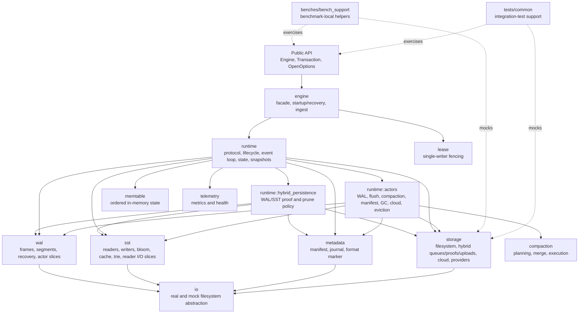
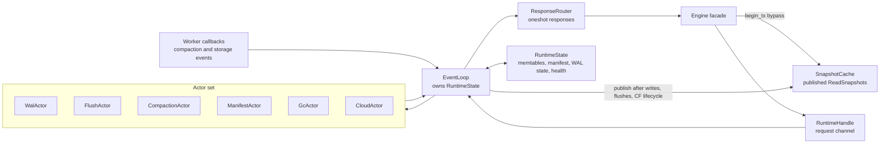
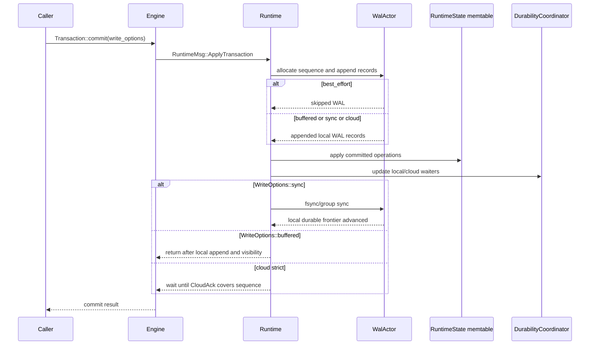
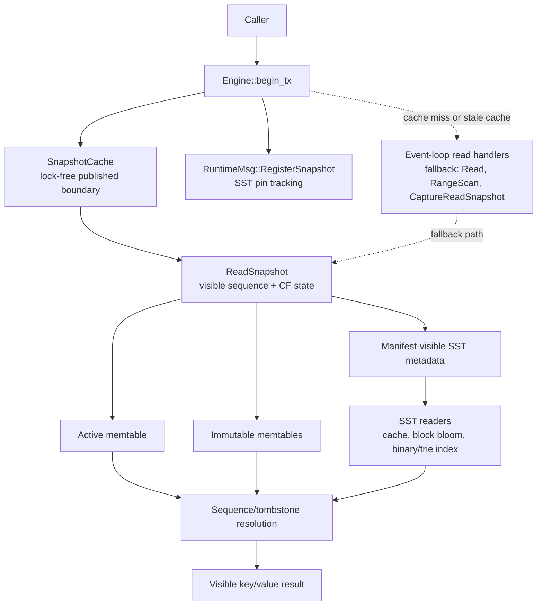
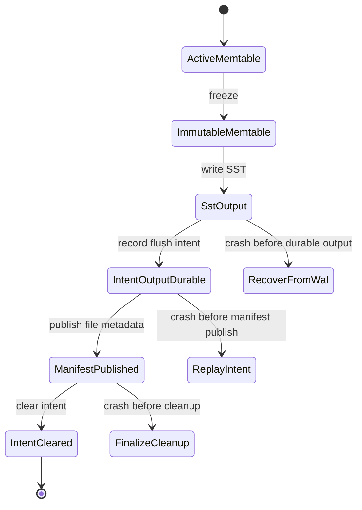
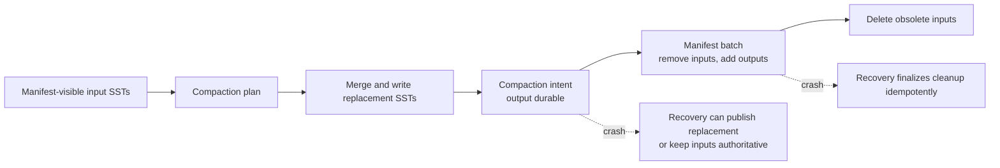
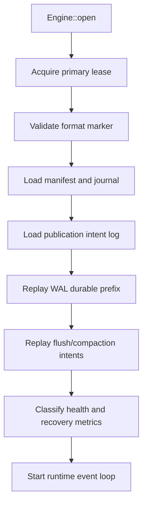
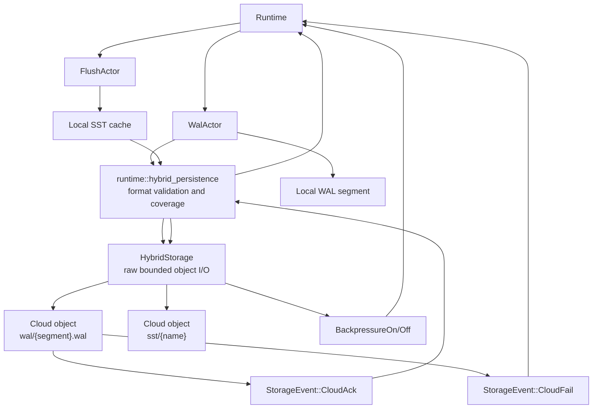
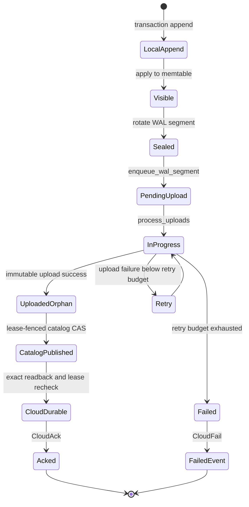
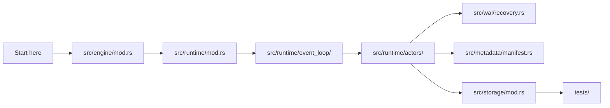

# Architecture Diagrams

This document is a visual companion to [architecture.md](architecture.md). It uses Mermaid diagrams to show the main ownership boundaries and data flows without replacing the invariant and recovery docs.

## Module Boundaries

## Runtime Ownership

The runtime owns mutable engine state. API calls cross into the runtime through messages; actors mutate state only through the event loop.

Actor-local mutable state must remain transient and rebuildable. Authoritative recovered state belongs in `RuntimeState`, the manifest, WAL, SSTs, and the publication intent log.

## Write Path

Write visibility and write durability are related but not identical. The selected `WriteOptions` determines where commit waits before responding.

## Read Path

Reads use an immutable snapshot assembled from the current memtable, immutable memtables, and manifest-visible SSTs. Manifest visibility, not raw file presence, controls which SSTs participate.

## Flush Publication

Flush is staged so a crash cannot make an orphan SST authoritative by accident.

## Compaction Publication

Compaction follows the same authority boundary: inputs stay authoritative until the manifest publishes their replacement set.

## Recovery Sequence

Startup rebuilds trusted state in an order that keeps the manifest as the authority boundary and WAL as the durable prefix for unpublished writes: load the manifest and intent log, replay WAL, then replay publication intents.

## Hybrid Cloud Mode

The runtime owns format interpretation and publication/prune policy. Hybrid storage sees only explicit object keys, bytes, provider identities, bounded queues, and conditional operations.

## Cloud WAL Durability State

## Source Reading Map

## Related References

- [architecture.md](architecture.md)
- [recovery-internals.md](recovery-internals.md)
- [storage-invariants.md](storage-invariants.md)
- [testing.md](testing.md)
